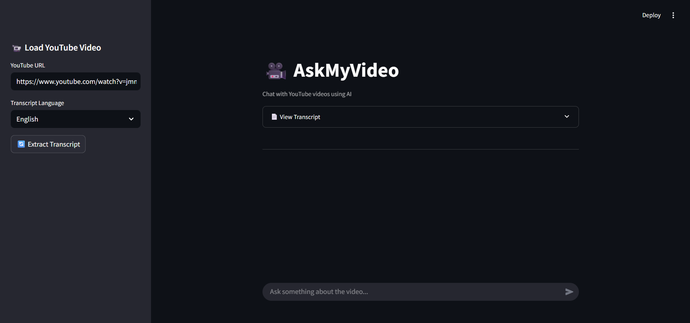

# 🎥 AskMyVideo

Transform any YouTube video into an interactive AI conversation. This Streamlit application allows users to extract information from YouTube videos by asking questions in natural language.





## ✨ Features

- **YouTube Video Analysis**: Automatically extracts and processes transcripts from any YouTube video
- **AI-Powered Q&A**: Ask questions about video content and get accurate, context-aware answers
- **Interactive UI**: Clean, intuitive interface with real-time responses

## 🚀 Getting Started

### Prerequisites

- Python 3.11
- Streamlit (For UI)
- Ollama (with Mistral 7B model installed and nomic-embed-text for embeddings)
- youtube-transcript-api library for transcript extraction
- LangChain framework for RAG (Retrieval-Augmented Generation)

### Installation

1. Clone the repository
   ```bash
   git clone https://github.com/RazaMasood/AskMyVideo.git
   cd askmyvideo
   ```

2. Install dependencies
   ```bash
   pip install -r requirements.txt
   ```

3. Run the application
   ```bash
   python main.py
   ```
   ```bash
   streamlit run app.py
   ```

## 📋 How to Use

1. **Load a Video**: Paste a YouTube URL in the sidebar input field
2. **Process Video**: Click "Extract Transcript" to extract and analyze the content
3. **Ask Questions**: Type your questions about the video in the main chat area
4. **Review Answers**: Get AI-generated responses based on the video content

## 🔍 How It Works

1. **Transcript Extraction**: The app extracts the transcript from the provided YouTube video
2. **Text Processing**: The transcript is processed and embedded using Nomic for semantic search
3. **RAG Pipeline**: Uses a Retrieval-Augmented Generation approach to find relevant sections of the transcript
4. **Ollama Integration**: Sends context and queries to locally-hosted Mistral 7B model via Ollama
5. **Response Generation**: Delivers accurate answers based on the retrieved context

## 📁 Project Structure

```
Project root/
├── app.py                  # Main Streamlit application file
├── main.py                 # API
├── api.py                  
│   ├── rag_api.py          # RAG API endpoints
│   └── transcript_api.py   # Transcript API endpoints   
├── assets/                 # Screenshots
├── model/                  # pydentic model   
├── modules/
│   ├── transcript.py       # Transcript extraction functionality
│   └── rag_pipeline.py     # RAG (Retrieval Augmented Generation) setup
├── requirements.txt        # Project dependencies
├── README.md               # Project documentation
```

## 🛠️ Technologies Used

- **Streamlit**: For the web interface
- **LangChain**: For the RAG pipeline
- **Ollama**: For running Mistral 7B locally
- **Mistral 7B**: Open-source LLM for natural language processing
- **Nomic Embeddings**: For semantic text embeddings
- **YouTube API**: For transcript extraction
- **FastAPI**: For building API endpoints
- **Vector Database**: For efficient semantic search

## 🤝 Contributing

Contributions are welcome! Please feel free to submit a Pull Request.

1. Fork the repository
2. Create your feature branch (`git checkout -b feature/amazing-feature`)
3. Commit your changes (`git commit -m 'Add some amazing feature'`)
4. Push to the branch (`git push origin feature/amazing-feature`)
5. Open a Pull Request

## 📄 License

This project is licensed under the MIT License - see the [LICENSE](LICENSE) file for details.

---

Built with ❤️ using Streamlit and AI